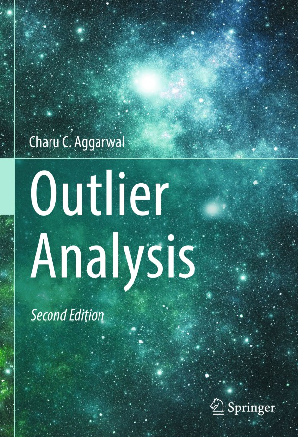

# Outlier_Analysis

Outlier Analysis by Charu C. Aggarwal 汉化翻译

### 1.异常检测简介

### 2.基于概率模型的异常检测

### 3.基于线性模型的异常检测

### 4.基于邻近距离的异常检测

### 5.基于集成学习的异常检测

### 6.基于有监督学习的异常检测

### 7.类别、文本和混合属性数据

### 8.时间序列和数据流上的异常检测

### 9.时间序列和数据流上的异常检测

### 10.离散序列的异常检测

### 11.稀疏属性数据的异常检测

### 12.图和网结构中的异常检测

### 13.异常检测的实际应用

